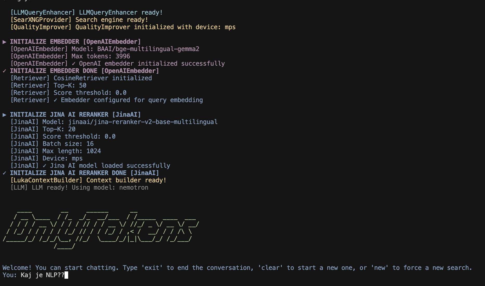

# Natural language processing course: `OnlyTokens`


## About 

This project aims to develop an advanced conversational agent that leverages Retrieval-Augmented Generation
(RAG) to enhance response quality and factual accuracy. Unlike traditional chatbots relying solely on pre-trained
knowledge, our system will incorporate real-time web scraping capabilities to retrieve up-to-date information from
the internet. By dynamically fetching and integrating external information during conversation, the agent can
provide more accurate, comprehensive, and current responses. 

## Demo

[](https://youtu.be/3oiyDnioyTw)

*Click the image above to watch the demo video*

### Setup

install uv 

```
curl -fsSL https://get.uv.dev | sh
```

install dependencies

```
uv sync
```

install/update browser engine for playwright

```
uv run python -m  playwright install  
```

### Start SearXNG

1. Navigate to the SearXNG directory:
```
cd searxng-docker
```

1. Edit the environment file:
```
touch .env && echo "SEARXNG_HOSTNAME=localhost" >> .env
```

1. Start SearXNG using Docker Compose:
```
docker-compose up -d
```

1. SearXNG will be available at `http://localhost:5555`


### Run the pipeline with our remote cluster model  that is available for you to use
```
uv run main.py --config config.yaml
```

### Run the pipeline with OpenAI instead of our remote cluster model.
```
export OPENAI_API_KEY=<your-openai-api-key> && uv run main.py --config config.yaml --use-openai
```


# Full Documentation

link to full documentation:
https://deepwiki.com/TheLukaDragar/super-search


